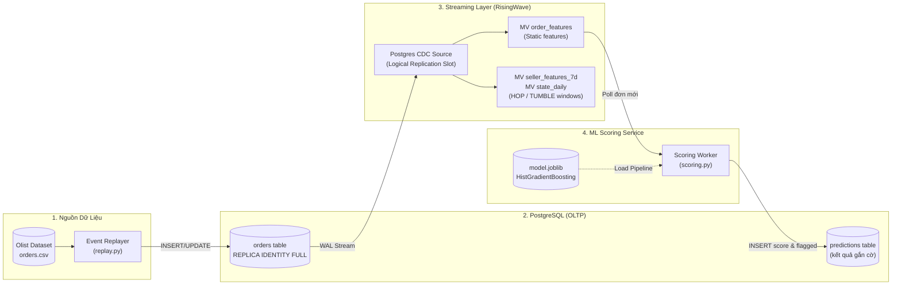

# Olist Streaming: Real-Time Order Late Delivery Prediction Pipeline

Hệ thống **Machine Learning thời gian thực (Real-time ML & Streaming Pipeline)** dự đoán sớm nguy cơ giao hàng trễ (`is_late`) của các đơn hàng thương mại điện tử (dựa trên bộ dữ liệu [Olist Brazilian E-Commerce](https://www.kaggle.com/datasets/olistbr/brazilian-ecommerce)) ngay tại thời điểm khách hàng vừa đặt đơn (`purchase_ts`), giúp đội ngũ vận hành logistics có thể can thiệp kịp thời.

---

## 📌 Điểm nổi bật của dự án

- **Kiến trúc Streaming CDC tinh gọn**: Kết hợp **PostgreSQL** (OLTP) và **RisingWave** (Streaming Database) thông qua cơ chế Logical Replication CDC, tính toán Materialized Views theo cửa sổ thời gian (`HOP` và `TUMBLE`) mà không gây tải cho database nghiệp vụ.
- **Tuân thủ chuẩn mực Time-Series ML**: Chia tập dữ liệu hoàn toàn theo thời gian thực tế (**Out-of-Time split**); tính toán đặc trưng lịch sử chuẩn điểm thời gian (**Point-in-Time Correctness**) bằng `searchsorted`, ngăn chặn triệt để rò rỉ dữ liệu (Data Leakage).
- **Phân tích bóc tách (Ablation Study) & Concept Drift**: Thực nghiệm chứng minh hiện tượng trôi dạt phân phối và tính thưa thớt (sparsity) của dữ liệu logistics, từ đó tối ưu hóa bộ đặc trưng tinh gọn cho mô hình production.
- **Kiểm soát Training-Serving Skew**: Script kiểm định đối chiếu tự động đảm bảo đặc trưng tính trên Streaming SQL khớp 100% với mã nguồn Pandas offline (sai số số học $< 10^{-6}$).
- **Đo lường theo tác động kinh doanh**: Sử dụng bài toán phân vị cao nhất (Top Decile), tối ưu hóa **Precision@top10%**, **Recall@top10%** và đạt mức tăng trưởng **Lift 2.24x** trên tập kiểm thử độc lập.

---

## 🏛️ Kiến trúc Hệ thống (Architecture)



### Luồng xử lý dữ liệu:
1. **Event Replayer**: Giả lập luồng đơn hàng phát sinh từ dữ liệu lịch sử với tốc độ có thể tùy chỉnh (`--speedup`). Đơn hàng mới phát sinh sự kiện `INSERT`, khi giao hàng hoàn tất phát sinh sự kiện `UPDATE`.
2. **PostgreSQL**: Lưu trữ trạng thái đơn hàng. Bảng `orders` được cấu hình `REPLICA IDENTITY FULL`.
3. **RisingWave CDC**: Kết nối trực tiếp vào replication slot của PostgreSQL (`rw_olist_slot`), duy trì các Materialized Views phục vụ thống kê và suy luận trực tiếp.
4. **Scoring Service**: Lắng nghe các đơn hàng mới qua RisingWave, chạy qua pipeline `HistGradientBoostingClassifier`, nếu rủi ro $\ge \text{threshold}$ sẽ gắn cờ `flagged = True` và ghi ngược về bảng `predictions` trên PostgreSQL.

---

## 🔬 Phương pháp Machine Learning

### 1. Phân chia tập dữ liệu (Time-based Splitting)
Dữ liệu được chia theo mốc thời gian thực để phản ánh môi trường triển khai thực tế:
- **Train (2017-01-01 -> 2017-12-31)**: 43,426 đơn (tỷ lệ trễ 6.6%).
- **Validation (2018-01-01 -> 2018-03-31)**: 20,627 đơn (tỷ lệ trễ 14.6% - giai đoạn đỉnh điểm đình công bưu chính/lễ hội). Dùng để chọn ngưỡng quyết định.
- **Test (2018-04-01 -> 2018-08-31)**: 32,150 đơn (tỷ lệ trễ 6.0%). Dùng đánh giá hiệu năng cuối cùng.

### 2. Thiết kế Đặc trưng (Feature Engineering)
- **Đặc trưng tĩnh (Static)**: `price`, `freight`, `freight_ratio` (tỷ lệ cước/giá), `n_items`, `installments`, `est_days` (khoảng cách ngày dự kiến giao so với ngày mua), `hour`, `dow` (ngày trong tuần), `payment_type`, `category`, `customer_state`.
- **Đặc trưng động (Dynamic/Streaming)**: `seller_n_orders_7d`, `seller_n_del_30d`, `seller_late_rate_30d`, và các biến tương tự cho `customer_state`. Được tính toán đảm bảo điều kiện nghiêm ngặt: $t_{\text{giao hàng}} < t_{\text{mua hàng}}$.

### 3. Kết quả Thực nghiệm & Ablation Study

#### So sánh thuật toán (trên Validation set):
| Mô hình | Bộ đặc trưng | PR-AUC | ROC-AUC | Precision@top10% | Recall@top10% |
| :--- | :--- | :---: | :---: | :---: | :---: |
| Logistic Regression | Tĩnh + Động | 0.235 | 0.656 | 0.291 | 0.199 |
| **HistGradientBoosting** | **Chỉ Tĩnh** | **0.277** | **0.689** | **0.343** | **0.235** |
| HistGradientBoosting | Tĩnh + Động | 0.244 | 0.658 | 0.304 | 0.208 |

*(Đường cơ sở ngẫu nhiên PR-AUC = 0.146)*

#### Phân tích Ablation Study (5 seed ngẫu nhiên):
- Chỉ đặc trưng tĩnh: **$0.280 \pm 0.003$**
- Tĩnh + Seller động: **$0.253 \pm 0.004$**
- Tĩnh + State động: **$0.259 \pm 0.008$**
- Tĩnh + Cả hai: **$0.247 \pm 0.004$**

> **Phát hiện quan trọng**: Việc bổ sung đặc trưng động làm giảm hiệu năng do:
> 1. Tính thưa thớt của dữ liệu người bán (hơn 76% người bán không có đủ đơn hàng giao trong 30 ngày trước).
> 2. Sự thay đổi phân phối đột ngột giữa các quý (Concept Drift) do các yếu tố ngoại cảnh (thời vụ, đình công bưu chính). Vì vậy, mô hình Production chỉ dùng **bộ đặc trưng tĩnh** để tối ưu hóa hiệu quả và giảm thiểu rủi ro vận hành.

#### Đánh giá trên tập TEST độc lập:
- **Ngưỡng quyết định**: $\approx 0.114$ (gắn cờ 10% đơn hàng rủi ro cao nhất ở Validation).
- **Tỷ lệ gắn cờ**: 16.1% số đơn hàng.
- **Precision**: 13.5% (gấp hơn 2.2 lần tỷ lệ trễ tự nhiên 6.0%).
- **Recall**: 36.1% (bắt được 36.1% tổng số đơn trễ thực tế).
- **Lift**: **2.24x**.

---

## 📂 Cấu trúc Thư mục

```
olist-streaming/
├── data/
│   ├── raw/                 # Dữ liệu CSV Olist gốc
│   └── processed/           # Dữ liệu đã xử lý (orders.csv, features_all.csv, ...)
├── sql/
│   ├── postgres/
│   │   ├── 01_schema.sql         # Schema bảng orders & cấu hình CDC
│   │   └── 02_predictions.sql    # Schema bảng predictions
│   └── risingwave/
│       ├── 01_source.sql         # Postgres CDC Source
│       ├── 02_features.sql       # Materialized Views thống kê cửa sổ (HOP/TUMBLE)
│       └── 03_order_features.sql # Materialized View chuẩn bị feature chấm điểm
├── src/olistream/
│   ├── config.py            # Quản lý cấu hình kết nối DB
│   ├── db.py                # Wrapper kết nối PostgreSQL & RisingWave
│   ├── features.py          # Logic trích xuất đặc trưng
│   ├── replay.py            # Công cụ giả lập luồng sự kiện
│   ├── train.py             # Script huấn luyện & so sánh mô hình
│   ├── scoring.py           # Worker chấm điểm qua RisingWave
│   └── scoring_direct.py    # Worker chấm điểm trực tiếp qua PostgreSQL
├── scripts/
│   ├── prepare.py           # ETL dữ liệu thô sang orders.csv
│   ├── eda_1.py             # Khám phá dữ liệu & sinh báo cáo profiling
│   ├── make_features.py     # Tạo đặc trưng tĩnh offline
│   ├── make_dynamic.py      # Tạo đặc trưng động & kiểm tra rò rỉ
│   ├── split_check.py       # Kiểm tra phân phối đơn theo tháng
│   ├── drift_check.py       # Kiểm tra concept drift theo từng quý
│   ├── ablation.py          # Thử nghiệm bóc tách đặc trưng
│   ├── final_eval.py        # Đánh giá cuối & xuất models/model.joblib
│   └── skew_check.py        # Kiểm tra Training-Serving Skew (RisingWave vs Pandas)
├── models/
│   └── model.joblib         # File model scikit-learn pipeline đã huấn luyện
├── .env.example             # Mẫu cấu hình môi trường
└── pyproject.toml           # Cấu hình cài đặt package
```

---

## 🚀 Hướng dẫn Sử dụng (Quickstart)

### 1. Cài đặt Môi trường
```bash
git clone https://github.com/MinhTran110/order-streaming.git
cd order-streaming

python -m venv .venv
source .venv/bin/activate
pip install -e .
```

Tạo file cấu hình `.env` từ file mẫu:
```bash
cp .env.example .env
```

### 2. Quy trình Machine Learning Offline
Bạn có thể tái lập toàn bộ quy trình khoa học dữ liệu mà không cần khởi động database:

```bash
# 1. Chuẩn bị dữ liệu và tạo features
python scripts/prepare.py
python scripts/make_features.py
python scripts/make_dynamic.py

# 2. Kiểm tra drift và ablation
python scripts/split_check.py
python scripts/drift_check.py
python scripts/ablation.py

# 3. Huấn luyện mô hình và lưu ra file model.joblib
python scripts/final_eval.py
```

### 3. Vận hành Hệ thống Streaming Real-Time

#### Bước 3.1: Khởi động Hạ tầng (PostgreSQL & RisingWave)
1. **Khởi động PostgreSQL**:
   Đảm bảo PostgreSQL đang chạy trên port `5432` với `wal_level = logical`.
   ```bash
   psql -h 127.0.0.1 -p 5432 -U olist -d olist -f sql/postgres/01_schema.sql
   psql -h 127.0.0.1 -p 5432 -U olist -d olist -f sql/postgres/02_predictions.sql
   ```

2. **Khởi động RisingWave** (qua Docker):
   ```bash
   docker run -d --name risingwave \
     -p 4566:4566 -p 5691:5691 \
     risingwavelabs/risingwave:latest playground
   ```

3. **Tạo CDC Source & Views trên RisingWave**:
   ```bash
   psql -h 127.0.0.1 -p 4566 -U root -d dev -f sql/risingwave/01_source.sql
   psql -h 127.0.0.1 -p 4566 -U root -d dev -f sql/risingwave/02_features.sql
   psql -h 127.0.0.1 -p 4566 -U root -d dev -f sql/risingwave/03_order_features.sql
   ```

#### Bước 3.2: Chạy Scoring Service
Mở một terminal mới:
```bash
python -m olistream.scoring
```

#### Bước 3.3: Phát luồng sự kiện (Event Replay)
Mở một terminal khác để tua luồng dữ liệu giả lập từ ngày 2018-04-01:
```bash
python -m olistream.replay --speedup 86400 --start 2018-04-01
```

#### Bước 3.4: Kiểm tra kết quả
Truy vấn bảng `predictions` trên PostgreSQL để xem các đơn bị gắn cờ rủi ro:
```sql
SELECT p.order_id, p.score, p.flagged, o.price, o.freight, o.customer_state
FROM predictions p
JOIN orders o ON p.order_id = o.order_id
WHERE p.flagged = true
ORDER BY p.score DESC
LIMIT 10;
```
